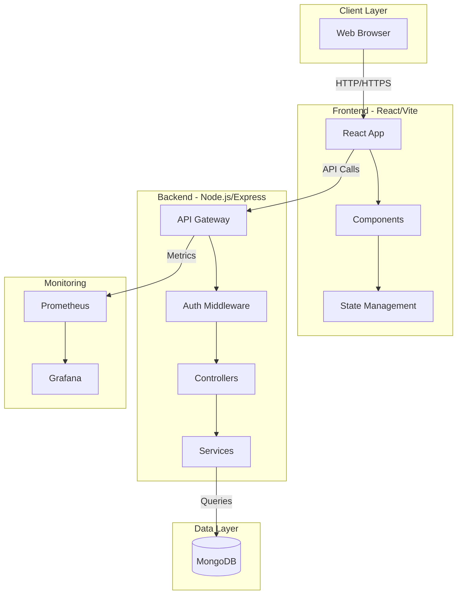
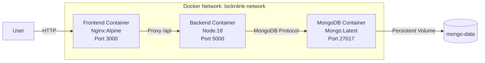
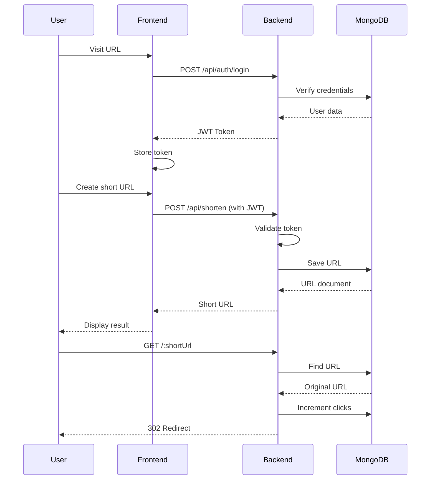
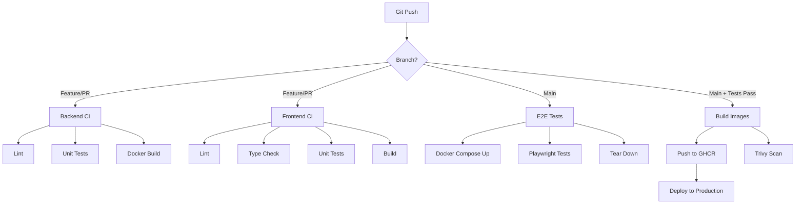
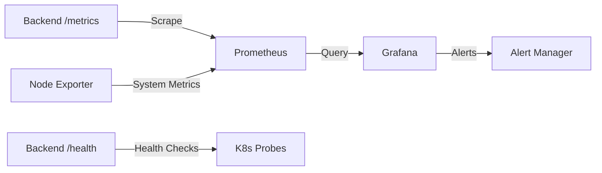

# Architecture Documentation

## System Architecture



## Docker Services Architecture



## Data Flow



## CI/CD Pipeline



## Monitoring Architecture



## Component Breakdown

### Frontend Components
- **AuthForm**: User authentication
- **UrlShortener**: URL creation interface
- **UrlList**: Display user's URLs
- **Analytics**: Dashboard with metrics

### Backend Routes
- **/api/auth**: Authentication endpoints
- **/api/shorten**: URL shortening
- **/api/urls**: User URL management
- **/:shortUrl**: Redirect handler

### Database Schema

**Users Collection:**
```javascript
{
  _id: ObjectId,
  email: String (unique),
  password: String (hashed),
  createdAt: Date
}
```

**URLs Collection:**
```javascript
{
  _id: ObjectId,
  originalUrl: String,
  shortUrl: String (unique),
  userId: ObjectId (ref: User),
  clicks: Number,
  isPasswordProtected: Boolean,
  password: String (hashed, optional),
  passwordAttempts: Number,
  isActive: Boolean,
  createdAt: Date
}
```

## Security Layers

1. **Network**: CORS, Rate Limiting
2. **Authentication**: JWT tokens
3. **Authorization**: User-specific resources
4. **Data**: Password hashing (bcrypt)
5. **Infrastructure**: Docker isolation, K8s network policies
